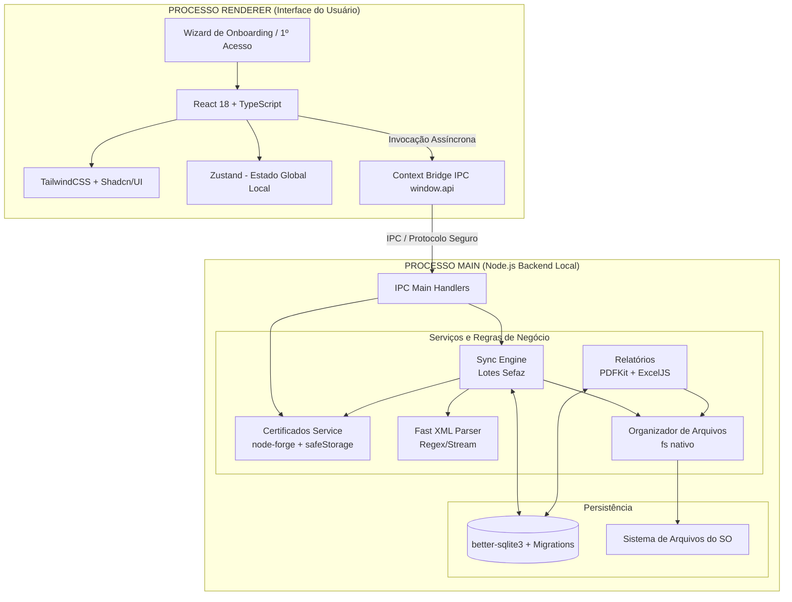

# DOCUMENTAÇÃO TÉCNICA E ARQUITETURAL DE PONTA A PONTA
## NFSe Sync Desktop
**Versão:** 2.2 (Especificação Técnica Definitiva - Todas as Lacunas Resolvidas)
**Status:** Aprovado para Desenvolvimento

---

# 1. SUMÁRIO EXECUTIVO E VISÃO DO PRODUTO

O **NFSe Sync** é um aplicativo desktop projetado para automatizar o download, organização e controle de documentos fiscais eletrônicos (NFS-e) através da API Nacional da NFS-e.
Sua proposta é operar de forma **Local-First**, removendo a necessidade de varreduras em disco ao centralizar todos os metadados num banco de dados relacional embarcado (SQLite), usando o File System local estritamente para armazenamento frio de binários (XML, PDF, XLSX).

## 1.1 Objetivo do Produto
Eliminar as horas perdidas por contadores e empresários em portais do governo. A ferramenta faz a consulta de NSU (Número Sequencial Único), baixa notas em lote, extrai retenções, organiza tudo em pastas automáticas por competência e gera relatórios — tudo em background.

## 1.2 Proposta de Valor e Público
Focado em pequenas/médias empresas e BPOs financeiros, o sistema exige apenas o cadastro do Certificado, a seleção de uma pasta base e um clique em "Sincronizar".

### 1.3 Benefício Secundário (Side-Effect Positivo)
Ao estruturar a resiliência técnica contra erros da Sefaz (lendo a data interna do PFX), o aplicativo se tornou, por tabela, um **Mini Gerenciador de Certificados Digitais**.
Escritórios de contabilidade sofrem para rastrear os vencimentos de dezenas de clientes. O *NFSe Sync Desktop* resolve isso de graça, exibindo na sua tela inicial um painel visual avisando quais certificados *"Vencem em Breve"* (em Amarelo) e marcando como *"Expirados"* (em Vermelho), evitando paradas abruptas no fechamento mensal do cliente.

---

# 2. ARQUITETURA DE SOFTWARE E CÓDIGO

O aplicativo segue o paradigma de **Múltiplos Processos do Electron**, garantindo segurança e fluidez. A UI nunca trava durante os downloads pesados.

## 2.1 Diagrama Arquitetural de Componentes



## 2.2 Escolhas Tecnológicas Detalhadas

| Camada | Tecnologia | Justificativa Profunda |
| :--- | :--- | :--- |
| **Interface** | React + Tailwind + Shadcn | Shadcn não instala pacotes opacos; injeta componentes brutos configuráveis via Tailwind. React garante a reatividade necessária para barras de progresso ao vivo. |
| **DB Local** | `better-sqlite3` (WAL Mode) | Síncrono no Node.js. Será configurado obrigatoriamente com `db.pragma('journal_mode = WAL')` e `db.pragma('synchronous = NORMAL')` para máxima performance de I/O em lotes pesados sem travar a interface. |
| **Migrações e Tipagem** | `Kysely` + `kysely-migration` | Escolha definitiva sobre Knex ou TypeORM. O Kysely é extremamente leve, 100% type-safe com TypeScript e lida perfeitamente com SQLite para migrações em ambiente desktop. |
| **Segurança Electron** | `contextIsolation: true` | Padrão estrito de segurança ativado. `nodeIntegration: false`. O Renderer (React) jamais terá acesso ao `fs` ou `crypto` nativo; tudo passa estritamente pela ponte IPC segura. |
| **Criptografia e Memória**| `node-forge` e `safeStorage` | A senha descriptografada no Node será usada apenas para derivar uma chave temporária em memória, sendo descartada o mais rápido possível para evitar dump de memória. |
| **Integração Sefaz** | `https.Agent` + Axios | A Sefaz requer mTLS. Instanciamos o HTTPS Agent passando a `key` e o `cert` extraídos, acoplando isso no cliente HTTP. |
| **Processamento**| `fast-xml-parser` + `zlib` | Descompressão de GZIP em RAM. Regex + normalização bruta evita o travamento de memória (OOM) que parsers DOM causariam. |
| **Testabilidade** | `Vitest` | Ferramenta moderna e rápida para testes unitários. Foco em testar o Parser de Retenções e o Motor de Fila com Mock do `https.Agent`. |

---

# 3. COMPREENSÃO DA API ADN SEFAZ E NSU

## 3.1 A Lógica do Número Sequencial Único (NSU)
A Receita não envia notas por "Período". Todo evento vinculado a um CNPJ ganha um identificador sequencial. O aplicativo deve pedir o NSU subsequente ao último que processou.

## 3.2 O Fluxo de Rede e Motor de Resiliência (Rate Limit e Timeouts)
A infraestrutura do governo flutua muito. O nosso `SyncService` operará como um **Motor de Resiliência Adaptativo**.
*   **Endpoint Padrão:** `GET https://adn.nfse.gov.br/contribuintes/DFe/{ultimo_nsu}?lote=true` (Máx 500 documentos por lote).
*   **Velocidade Base (Throttling):** O sistema implementará um *delay mínimo obrigatório* (ex: 1.5 a 2 segundos) entre o fim de um lote e o pedido do próximo NSU.
*   **Tratamento de Rate Limit (HTTP 429):** Se o governo bloquear por excesso, o motor lerá o cabeçalho `Retry-After`, pausará a thread (`await delay()`) e avisará a UI ("Sefaz limitando tráfego, aguardando 30s...").
*   **Timeouts e Quedas (HTTP 502, 503, 504):** O NodeJS aplicará um `AbortController` (timeout fixo). Se falhar, entra em **Exponential Backoff** (2s, 4s, 8s). Após 5 falhas seguidas, o lote sofre `ROLLBACK` seguro, encerra com `FALHA_CONEXAO` e notifica o usuário sem quebrar o app.

## 3.3 Contrato de Dados da API (Payload da Sefaz Nacional)
Através da nossa análise prévia de integração, mapeamos exatamente o formato que a Sefaz responde. O parser Node aguardará esta estrutura exata de JSON (já decodificado após mTLS):

```json
{
  "StatusProcessamento": "DOCUMENTOS_LOCALIZADOS",
  "DataHoraProcessamento": "2026-06-16T10:00:00-03:00",
  "LoteDFe": [
    {
      "NSU": 15482,
      "ChaveAcesso": "12345678901234567890123456789012345678901234",
      "TipoDocumento": "NFSE",
      "TipoEvento": null,
      "DataHoraGeracao": "2026-06-15T15:30:00-03:00",
      "ArquivoXml": "H4sIAAAAAAAA/..." // Array de bytes GZIP codificado em Base64
    }
  ],
  "Alertas": [],
  "Erros": []
}
```

**Como o Parser lida com o `ArquivoXml`:**
O campo `ArquivoXml` **não** é o XML puro. É um buffer GZIP envelopado em Base64. A rotina em Node fará exatamente:
1. `Buffer.from(item.ArquivoXml, 'base64')`
2. `zlib.gunzipSync(compressedBuffer).toString('utf-8')`
3. Só então a string XML estrutural é liberada para a caça de Retenções (RN004) e organização física em pastas. Se a API retornar `StatusProcessamento: 'NENHUM_DOCUMENTO_LOCALIZADO'`, a sincronização é dada como Concluída.

---

# 4. REGRAS DE NEGÓCIO E SUA APLICAÇÃO ESTRITA NO CÓDIGO

### RN001 e RN002: Controle Transacional do NSU e Lotes (Batches)
*   **Regra:** O último NSU só é salvo após o documento ser validado, processado e gravado. Uma "Transaction" SQLite envolverá o lote.
*   **Como Aplicar:** Para evitar engasgos no disco, o processamento de grandes lotes da Sefaz será feito em **batches de 100 a 200 inserts** por transação. Ocorrendo sucesso no batch, faz-se o `COMMIT` atualizando o maior NSU na tabela certificados. Se falhar, faz-se o `ROLLBACK`.

### RN003: Prevenção de Documentos Duplicados
*   **Regra:** Um mesmo documento fiscal jamais pode ser gravado duas vezes no sistema, mesmo que a Sefaz o reenvie em lotes distintos.
*   **Como Aplicar:** A coluna `chave_documento` da tabela `documentos` possui constraint `UNIQUE`. A inserção usa `INSERT OR IGNORE INTO documentos`, que descarta silenciosamente qualquer tentativa de duplicação. No disco físico, o `fs.writeFileSync` sobrescreve o arquivo se já existir, garantindo idempotência total.

### RN004 e RN005: Retenções (Engenharia Avançada e Fallback Regex)
*   **Regra:** O parser implementará um fallback robusto para contornar qualquer variação de município. Antes do parser estrutural, aplica-se uma regex brutal: `const normalized = xml.toLowerCase().replace(/<[^>]+>/g, tag => tag.toLowerCase());`. Mapeamos `vissret`, `valorissretido`, `vretiss`.
*   **Validação Cruzada:** Verifica se o valor líquido é menor que o serviço (`vLiq < vServ`) para achar retenções silenciosas, e checa flags booleanas (`tpRetIssqn = 2`). Documentos com retenção ganham cópia na pasta `/Retencoes/XML/` e disparam recriação de PDFs/Excels.
*   **Filtro Obrigatório:** Toda query de relatório de retenções DEVE incluir `WHERE d.status = 'ATIVA'`. Notas canceladas (RN010) que possuíam retenção continuam na tabela `retencoes` para auditoria, mas são excluídas dos totalizadores e arquivos gerados.

### RN006 a RN008: Organização Física de Pastas
*   **Regra:** XMLs existem fisicamente no disco no formato: `[Pasta Base]/[CNPJ]/AAAA-MM/[Tipo]`. O tipo depende da comparação do CNPJ Emitente/Tomador com o certificado.

### RN009: Validade, Controle e Segurança do Certificado
*   **Regra:** Certificados expirados não podem tentar conectar na Sefaz. Senhas não podem ficar flutuando na memória do V8.
*   **Como Aplicar:** No momento do cadastro (UC001), o `node-forge` lê a data de validade (`validity.notAfter`) do PFX e salva na coluna `validade_cert`. Na sincronização, a senha descriptografada será usada APENAS no momento exato de derivar o Agente HTTPS, sendo imediatamente descartada/limpa da memória para garantir a segurança da infraestrutura do cliente.

### RN010: Cancelamentos e Eventos de Substituição
*   **Regra:** Notas canceladas não podem inflar os totalizadores nem enganar o relatório de retenções.
*   **Como Aplicar:** Quando a Sefaz retornar um XML do tipo `EVENTO` de cancelamento, o Parser lerá a `<chNFSe>` (Chave) da nota referenciada. O sistema então fará: `UPDATE documentos SET status = 'CANCELADA' WHERE chave_documento = ?`. As notas canceladas serão excluídas (via `WHERE status = 'ATIVA'`) das queries de totalizadores e relatórios.

### RN011: Logs Granulares de Erros
*   **Regra:** Um erro num único NSU não deve cegar o suporte técnico.
*   **Como Aplicar:** Quando o `fast-xml-parser` explodir para um XML específico, o catch fará o insert na tabela `sync_erros` informando a sincronização, o NSU afetado e a stack do erro. O lote todo sofre rollback por segurança.

### RN012: Sincronização Serial (Fila de Empresas)
*   **Regra:** Múltiplos certificados NUNCA sincronizam em paralelo. O `better-sqlite3` é síncrono e o Event Loop do Node travaria com escritas concorrentes de lotes de 500 notas.
*   **Como Aplicar:** O `SyncService` mantém uma **fila FIFO** interna. Ao clicar em "Sincronizar Todas", as empresas entram na fila e são processadas uma por vez. A UI mostra a fila com indicador visual: `[✓ Empresa A] → [⟳ Empresa B processando...] → [⏳ Empresa C aguardando]`.

### RN013: Tratamento de Disco Cheio e Limpeza de Órfãos
*   **Regra:** Se o HD do usuário encher durante a gravação de XMLs, o sistema não pode deixar arquivos "órfãos" no disco (XMLs gravados sem referência no banco após o ROLLBACK).
*   **Como Aplicar:** Antes de gravar no disco, o sistema coleta os caminhos planejados num array `arquivosPendentes[]`. Se o `fs.writeFileSync` ou o `COMMIT` falharem, o bloco `catch` itera sobre `arquivosPendentes` e executa `fs.unlinkSync()` para cada arquivo que já havia sido escrito, limpando os órfãos. O ROLLBACK cuida do banco, e a limpeza cuida do disco.

### RN014: Backup e Restauração do Banco de Dados
*   **Regra:** Se o HD do usuário falhar, todo o histórico (NSUs, metadados, retenções) seria perdido, pois o `.sqlite` fica fora da pasta sincronizada.
*   **Como Aplicar:** O app oferecerá dois botões na tela de Configurações:
    - **"Exportar Backup":** Copia o `database.sqlite` para uma pasta escolhida pelo usuário (ou para a própria pasta base, que pode estar no Google Drive).
    - **"Importar Backup":** Disponível no Onboarding (UC006), permite que o usuário aponte para um `.sqlite` existente. O Node valida a integridade do banco (`PRAGMA integrity_check`) antes de aceitar.

---

# 5. MODELAGEM RELACIONAL DE BANCO DE DADOS (SQLITE)

```sql
-- TABELA: configuracoes (Geral do App)
CREATE TABLE configuracoes (
    id TEXT PRIMARY KEY,
    pasta_base TEXT NOT NULL,
    delay_throttle INTEGER DEFAULT 2000,
    sinc_intervalo_horas INTEGER DEFAULT 24, -- Frequencia global do CRON
    created_at DATETIME DEFAULT CURRENT_TIMESTAMP
);

-- TABELA: certificados
CREATE TABLE certificados (
    id TEXT PRIMARY KEY, 
    cnpj TEXT NOT NULL UNIQUE, 
    razao_social TEXT NOT NULL,
    caminho_pfx TEXT NOT NULL,
    senha_criptografada BLOB NOT NULL,
    validade_cert DATETIME NOT NULL, -- RN009
    sinc_automatica BOOLEAN DEFAULT 1, -- Flag individual por empresa (UC010)
    ultimo_nsu INTEGER DEFAULT 0,
    ultima_sincronizacao DATETIME,
    created_at DATETIME DEFAULT CURRENT_TIMESTAMP
);

-- TABELA: sincronizacoes (Motor de Log)
CREATE TABLE sincronizacoes (
    id TEXT PRIMARY KEY,
    certificado_id TEXT NOT NULL REFERENCES certificados(id),
    data_inicio DATETIME NOT NULL,
    data_fim DATETIME,
    nsu_inicial INTEGER NOT NULL,
    nsu_final INTEGER,
    documentos_processados INTEGER DEFAULT 0,
    retencoes_encontradas INTEGER DEFAULT 0,
    status TEXT NOT NULL CHECK(status IN ('EM_ANDAMENTO', 'SUCESSO', 'ERRO', 'FALHA_CONEXAO'))
);

-- TABELA: sync_erros (Logs Granulares - RN011)
CREATE TABLE sync_erros (
    id TEXT PRIMARY KEY,
    sincronizacao_id TEXT NOT NULL REFERENCES sincronizacoes(id) ON DELETE CASCADE,
    nsu INTEGER NOT NULL,
    mensagem TEXT NOT NULL,
    created_at DATETIME DEFAULT CURRENT_TIMESTAMP
);

-- TABELA: documentos (Única Fonte de Consultas)
CREATE TABLE documentos (
    id TEXT PRIMARY KEY,
    certificado_id TEXT NOT NULL REFERENCES certificados(id),
    chave_documento TEXT UNIQUE NOT NULL,
    numero_nota TEXT NOT NULL,
    tipo TEXT NOT NULL CHECK(tipo IN ('EMITIDA', 'RECEBIDA', 'EVENTO')),
    status TEXT DEFAULT 'ATIVA' CHECK(status IN ('ATIVA', 'CANCELADA', 'SUBSTITUIDA')), -- RN010
    data_emissao DATETIME NOT NULL,
    competencia TEXT NOT NULL,
    cnpj_prestador TEXT, -- Filtros de Contabilidade
    nome_prestador TEXT,
    cnpj_tomador TEXT,
    nome_tomador TEXT,
    caminho_xml TEXT NOT NULL,
    possui_retencao BOOLEAN DEFAULT 0,
    valor_total REAL DEFAULT 0.0
);
CREATE INDEX idx_docs_competencia ON documentos(competencia);
CREATE INDEX idx_docs_tipo ON documentos(tipo);
CREATE INDEX idx_docs_status ON documentos(status);

-- TABELA: retencoes (Extensão 1:1)
CREATE TABLE retencoes (
    id TEXT PRIMARY KEY,
    documento_id TEXT UNIQUE NOT NULL REFERENCES documentos(id) ON DELETE CASCADE,
    iss REAL DEFAULT 0.0,
    inss REAL DEFAULT 0.0,
    irrf REAL DEFAULT 0.0,
    pis REAL DEFAULT 0.0,
    cofins REAL DEFAULT 0.0,
    csll REAL DEFAULT 0.0,
    total_retido REAL DEFAULT 0.0
);
```

---

# 6. ESTRUTURA FÍSICA NO SISTEMA OPERACIONAL

```text
/[Pasta Base Definida na Tabela Configuracoes]
└── NFSENacional
    └── 12345678000199 - EMPRESA XYZ LTDA
        └── 2026-06
            ├── Emitidas
            │   └── NFSE_100_CHAVE.xml
            ├── Recebidas
            │   └── NFSE_99_CHAVE.xml
            ├── Eventos
            │   └── EVENTO_CANCELAMENTO_CHAVE.xml
            └── Retencoes
                ├── XML
                │   └── NFSE_100_CHAVE.xml
                ├── Relatorio_Retencoes_2026-06.pdf
                └── Relatorio_Retencoes_2026-06.xlsx
```

---

# 7. CASOS DE USO TÉCNICO (FLUXOS IPC)

### UC006 - Onboarding / Primeiro Uso
1. **Frontend:** Ao abrir, se `SELECT COUNT(*) FROM configuracoes` for zero, bloqueia o Dashboard e abre o Wizard de Onboarding.
2. **Passo 1:** Pede para o usuário definir a Pasta Base (abre a janela do sistema via `dialog.showOpenDialog`).
3. **Passo 2:** Abre o modal para cadastrar o primeiro Certificado (UC001).
4. Após ambos concluídos, injeta no banco e libera o app.

### UC002 - Modal de Seleção e Gestão de Fila Serial
1. **Frontend (O Modal):** O botão "Sincronizar" abre um **Modal de Seleção de Empresas**. O React faz um `SELECT` rápido listando Razão Social, CNPJ, Status de Validade do Certificado e Última Sincronização.
2. **Ações do Modal:** O usuário tem uma barra de busca (para filtrar por nome) e checkboxes para escolher empresas individualmente ou usar "Selecionar Todas". Empresas com certificado vencido ficam bloqueadas (disabled).
3. **Frontend (Painel de Fila):** Ao clicar em "Iniciar", o Modal fecha e a tela principal vira um **Painel de Acompanhamento**. As empresas entram numa Fila (Estado Zustand). O card da empresa que está no topo ganha um *spinner* e barra de progresso viva. As outras ficam com status *⏳ Na Fila*.
4. **Backend (Execução Serial):** O Node puxa o item 1 da fila e executa a esteira (GET lote, Transaction SQLite, Parse, Commit). Ao acabar, passa para o item 2, evitando o engarrafamento fatal no banco síncrono. Tratamento de Disco Cheio aborta apenas a empresa atual e passa para a próxima.

### UC007 - Reprocessamento / Reset NSU (Recuperação de Falhas)
1. **Frontend:** Usuário vai nas configurações avançadas da Empresa e clica em "Reprocessar do Zero".
2. **Backend:** IPC dispara alerta vermelho pedindo confirmação.
3. Se confirmado, Node faz `DELETE FROM documentos WHERE certificado_id = ?` e `UPDATE certificados SET ultimo_nsu = 0 WHERE id = ?`.
4. Os XMLs físicos podem ser ignorados, pois a rotina de criação de arquivos fará a sobreposição silenciosa (`fs.writeFileSync`). O Sync recomeçará do zero varrendo tudo na Sefaz.

### UC008 - Backup e Restauração do Banco
1. **Exportar:** Usuário clica em "Exportar Backup" nas Configurações. O Node copia o `.sqlite` para o destino escolhido via `dialog.showSaveDialog`.
2. **Importar:** No Onboarding ou nas Configurações, o usuário aponta para um arquivo `.sqlite`. O Node roda `PRAGMA integrity_check` para validar. Se íntegro, substitui o banco atual e reinicia o app.

### UC009 - Menu de Ajuda e Guia do Usuário
1. **Frontend:** Na barra de navegação principal (Sidebar), haverá um botão permanente de "Ajuda / Guia do Usuário".
2. **Conteúdo Offline (Explicação Didática):** Uma seção interativa desenhada para explicar "a mágica" para contadores leigos:
   - **Como o sistema funciona:** Diagrama simples explicando a comunicação Sefaz -> App.
   - **Onde os arquivos ficam:** Botão direto para abrir a pasta raiz no Windows Explorer / Finder via `shell.openPath`.
   - **Tipos de Relatórios:** Como o app gera os Excel/PDF de Retenções e como eles aceleram o fechamento mensal da contabilidade.
   - **Glossário:** O que é PFX, o que significa a barra "Sincronização em Andamento", e como interpretar as mensagens de limite da Sefaz.
3. **Logs de Suporte:** Na mesma tela, um botão para "Copiar Log de Erros" que envia um select da tabela `sync_erros` para a Área de Transferência.

### UC010 - Sincronização Automática Granular e System Tray
1. **Nível de Controle:** Diferente de uma chave mestre "liga/desliga", a sincronização será **Granular**. Na tela de listagem de certificados, cada empresa terá um toggle: *"Sincronização Automática"*. (Coluna `sinc_automatica` do banco). O contador pode ligar para 10 empresas e desligar para 2 empresas problemáticas.
2. **Motor CRON (Node) e Bandeja (Tray):** O `main.ts` inicializa uma thread com `node-cron`. O aplicativo residirá na **System Tray** (Bandeja do Sistema) com um menu de contexto (clique direito) permitindo "Sincronizar Todas", "Pausar Automático" ou "Abrir Pasta Raiz", sem nem precisar abrir a UI do React.
3. **Query Inteligente:** No momento de "acordar", o daemon do Node executa: `SELECT id FROM certificados WHERE sinc_automatica = 1 AND validade_cert >= NOW()`. Somente as elegíveis são montadas no array.
4. **Execução Fantasma:** As empresas caem na Fila Serial (UC002). O IPC continua enviando os logs, mas como o app está minimizado na bandeja (System Tray), tudo ocorre de forma silenciosa (Parse de XMLs, SQLite, geração de PDF/Excel na pasta base).
5. **Notificação Agregada:** O sistema não envia um popup a cada empresa finalizada (para não virar spam). Ao esvaziar a Fila Serial fantasma, o Node agrega os resultados e dispara UMA notificação nativa do SO: *"Sincronização Automática Concluída. 10 empresas atualizadas. 45 novos documentos salvos."*

### UC011 - Importação de Certificados em Lote (Drag & Drop)
1. **Problema:** BPOs financeiros possuem dezenas de clientes e frequentemente usam uma "senha padrão" (ex: `123456`) para todos os certificados PFX que geram. Cadastrar um por um é lento.
2. **Frontend:** Na tela de Certificados, além de "Adicionar Certificado", haverá um botão **"Importação em Lote"**. O usuário pode arrastar 50 arquivos `.pfx` de uma vez para uma *Dropzone*. Abaixo, ele digita 1 a 3 senhas comuns que o escritório usa.
3. **Backend (Node.js):** O IPC recebe o array de caminhos dos arquivos e o array de senhas. Para cada arquivo, o `node-forge` tenta descriptografar testando as senhas fornecidas.
4. **Automação:** Como a aplicação Desktop lê o CNPJ e a Razão Social DIRETAMENTE de dentro do PFX, não é necessário fazer vínculo manual com empresas (como era na versão Web/Alvras). O sistema automaticamente faz o `INSERT` na tabela `certificados` com os dados extraídos.
5. **Feedback Visual:** Uma tabela de resultado rápido mostra: *48 importados com sucesso. 2 falharam (senha incorreta)*.

---

# 8. ESTRUTURA DE PASTAS DE DESENVOLVIMENTO (BOILERPLATE)

```text
/project-root
├── electron/
│   ├── main.ts            (Ponto de entrada, Configuração da Tray)
│   ├── preload.ts         (Ponte IPC, contextIsolation=true)
│   ├── services/
│   │   ├── sefaz.ts       (Client HTTP e Motor de Resiliência)
│   │   ├── cert.ts        (Leitura, cripto PFX e validação de expiração)
│   │   ├── parser.ts      (Fast XML Parser e Heurística de Impostos)
│   │   ├── reports.ts     (Geração PDF/Excel)
│   │   └── sync.ts        (Controlador de NSU)
│   └── db/
│       ├── connection.ts  (Instância do better-sqlite3 + PRAGMA WAL)
│       └── migrations/    (Kysely Migration Scripts)
├── src/                   (React Frontend)
│   ├── App.tsx
│   ├── components/
│   │   ├── ui/            (Shadcn Buttons, Inputs)
│   │   ├── onboarding/    (Fluxo do primeiro acesso)
│   │   └── dashboard/     (Estatísticas)
│   ├── store/             (Zustand State)
│   └── hooks/             (useIPCListeners)
├── __tests__/             (Vitest)
│   ├── parser.test.ts     (Garantia de qualidade da RN004)
│   └── sync.test.ts       (Mock da API da Sefaz e Resiliência)
├── tailwind.config.js
└── package.json
```

# 9. DESIGN SYSTEM E UI/UX

Antes do desenvolvimento visual no React, o produto é governado por um sistema de design restrito. O software deve parecer **moderno, rápido e confiável** (semelhante a ferramentas como Notion, Linear, Docker Desktop e Arc Browser), e se afastar completamente do visual "cinza e pesado" de ERPs fiscais ou governamentais tradicionais.

### 9.1 Conceito Visual e Tema
*   **Tema Principal:** Tema Claro (Light Mode).
*   **Justificativa:** Contadores e BPOs enfrentam fadiga visual devido a planilhas; o tema claro facilita a leitura de dados densos e tabelas.
*   **Psicologia das Cores:**
    *   **Azul (`#2563EB`):** Cor primária (Botões principais, Sidebar ativa, Indicadores). Transmite Segurança e Tecnologia.
    *   **Verde (`#10B981`):** Apenas para Sucesso (Sincronização concluída, Certificado válido).
    *   **Vermelho (`#EF4444`):** Apenas para Erro (Falhas, Certificados inválidos).
    *   **Amarelo (`#F59E0B`):** Apenas para Alertas (Certificados próximos de vencer).
*   **Tipografia:** `Inter` (Moderna, limpa, excelente legibilidade para dados numéricos).

### 9.2 Design Tokens
*   **Espaçamentos:** Múltiplos estritos: `8px`, `16px`, `24px`, `32px`. Nada de valores aleatórios.
*   **Bordas:** `border-radius: 12px` em tudo (Cards, Botões, Inputs, Modais).
*   **Sombras:** Leves e sutis. `box-shadow: 0 1px 3px rgba(0,0,0,0.08)`. Nada de sombras pesadas ou botões "3D/Gradients". Fundo de elementos base como a Sidebar é sólido (`#FFFFFF`).

### 9.3 Layout Geral e Telas

**A. Estrutura Base:**
Sidebar (Esquerda) com exatos `240px` de largura. Fundo branco puro. O menu ativo usa fundo azul super claro (`#EFF6FF`) e texto na cor primária.

**B. Dashboard (Tela Inicial):**
Extremamente focado e silencioso.
*   *Primeira Linha (Métricas Rápidas):* 4 Cards (Total Certificados, Total Documentos, Valor Total Retido em R$, Data da Última Sincronização).
*   *Segunda Linha (Ação):* Único CTA gigante e centralizado na tela: **[ Sincronizar Agora ]**.
*   *Estado "Em Sincronização":* O botão some e dá lugar ao acompanhamento da Fila: `Empresa Atual: EMPRESA XYZ | NSU: 15482 | Documentos: 250`. Abaixo, uma barra de progresso viva (`████████░░░░`).

**C. Tela de Certificados:**
Tabela limpa (Empresa, CNPJ, Último NSU, Validade, Ações).
*   *Botão Principal:* **[+ Adicionar Certificado]** no topo direito.
*   *Ações na Tabela:* Apenas ícones discretos (✏️ e 🗑️). Sem botões gigantes por linha.
*   *Modal de Inserção:* Minimalista. Apenas o campo para upload do Arquivo PFX e o campo da Senha. Ao salvar, o Node.js lê Razão Social e CNPJ automaticamente no background.

**D. Tela de Sincronizações e Configurações:**
*   *Sincronizações:* Tabela de log simples (Data, Empresa, Qtd Documentos, Qtd Retenções, Status com a bolinha colorida correspondente).
*   *Configurações:* Foco absoluto. Apenas campo mostrando `C:\Pasta\Escolhida` com botão `[Alterar]`, e o toggle do UC010 (Sincronização Automática em Background).

---

# CONCLUSÃO FINAL DA ENGENHARIA E DESIGN
Esta especificação cobre de ponta a ponta todas as camadas do produto. A infraestrutura de rede lida com o Rate Limit e Timeouts da Sefaz. O banco SQLite opera em transações ACID, e a heurística de retenção fiscal não deixa dinheiro passar despercebido. Coroando tudo isso, a interface (governada pelo Design System) abstrai toda essa complexidade bruta em uma UI minimalista inspirada no estado-da-arte (Linear/Notion), entregando um utilitário que o contador tem prazer de deixar rodando em segundo plano.

---

# 10. DOSSIÊ TÉCNICO DE ARQUITETURA E SEGURANÇA (TECH STACK)
*Nota: Este dossiê foi gerado durante a fase de pesquisa e análise de risco (Pré-Implementação).*

## 10.1 Electron JS
### 1. Visão Geral
*   **O que é:** Framework open-source para aplicações desktop nativas usando web (HTML/CSS/TS), embutindo Chromium e Node.js.
*   **Mantenedor:** OpenJS Foundation.
*   **Maturidade:** Lançado em 2013. Usado por VS Code, Slack, Discord.

### 2. Finalidade e Motivos
*   **Problema resolvido:** Permite construir softwares desktop cross-platform usando o ecossistema React.
*   A separação em Múltiplos Processos permite rodar o banco SQLite nativo pesado no *Main Process* em background sem congelar o *Renderer Process* (UI).

### 3. Segurança e Vulnerabilidades
*   **Histórico:** No passado sofria severas falhas de XSS -> RCE por expor o Node.js direto na UI.
*   **Práticas Modernas:** Seguro quando restrito via `contextIsolation: true` e `nodeIntegration: false`. 
*   **Correção de Falhas:** Herda os CVEs do engine V8 do Chrome, sendo atualizado num intervalo de horas. A recomendação é travar a dependência major (`^42.0.0`).

### 4. Conclusão Técnica
*   **Segurança:** 9.0 (Configurado de forma estrita) | **Performance:** 8.0 | **Maturidade:** 10.
*   **Veredito:** Ideal para a manipulação intensiva do File System local (XML/PDF) exigida pelo projeto.

---

## 10.2 better-sqlite3
### 1. Visão Geral e Finalidade
*   **O que é:** Driver nativo C++ super-rápido para SQLite no Node.js. Processa SQL de forma síncrona.

### 2. Segurança e Benefícios Técnicos
*   **Performance Nativa:** Aproveita a arquitetura single-user do Desktop Node para gravar dados massivos do lote da Sefaz em milissegundos sem deadlocks.
*   **SQL Injection:** Totalmente protegido ao utilizar `Prepared Statements` vinculados (bind parameter `?`).

### 3. Conclusão Técnica
*   **Segurança:** 9.5 | **Performance:** 10 | **Maturidade:** 9.5
*   **Veredito:** Escolha absoluta, superando de longe as limitações de concorrência do `sqlite3` clássico.

---

## 10.3 Kysely
### 1. Visão Geral e Finalidade
*   **O que é:** Type-safe SQL Query Builder nativo do TypeScript. Substitui ORMs gigantes como TypeORM.

### 2. Segurança e Motivos
*   **Segurança de Compilação:** Evita "typos" e referências mortas. O Typescript falha se uma coluna da tabela for referenciada incorretamente, garantindo integridade das queries.
*   **Proteção de Injeção:** Aplica serialização de parâmetros forçada de baixo nível, barrando manipulação maliciosa de queries.

### 3. Conclusão Técnica
*   **Segurança:** 10 (Mitigação de SQLi out-of-the-box).
*   **Veredito:** Mantém as migrações limpas e impede "N+1 queries" silenciosas na UI.

---

## 10.4 node-forge
### 1. Visão Geral e Finalidade
*   **O que é:** Implementação nativa JavaScript de criptografia (TLS, RSA, decriptação PFX/p12).

### 2. Segurança e Vulnerabilidades (Atenção Máxima)
*   **Risco Conhecido:** Implementar criptografia no engine V8 é suscetível a ataques de canal lateral comparado ao OpenSSL. Historicamente sofreu um CVE-2022-24675 (DoS).
*   **Estratégia de Mitigação (Mandatória):** O objeto criptográfico descriptografado com a senha do usuário só existirá em memória RAM pela fração de segundo necessária para instanciar o `https.Agent` para a Sefaz. O objeto deve sofrer "nulificação" forçada e Garbage Collection imediata para impedir captura em dumps.

### 3. Conclusão Técnica
*   **Segurança:** 8.0 (Forte, desde que com gestão de memória). | **Maturidade:** 9.0
*   **Veredito:** O "Mal Necessário". Evita as instabilidades desastrosas de compilação de bindings OpenSSL no Windows, focando na usabilidade B2B.
